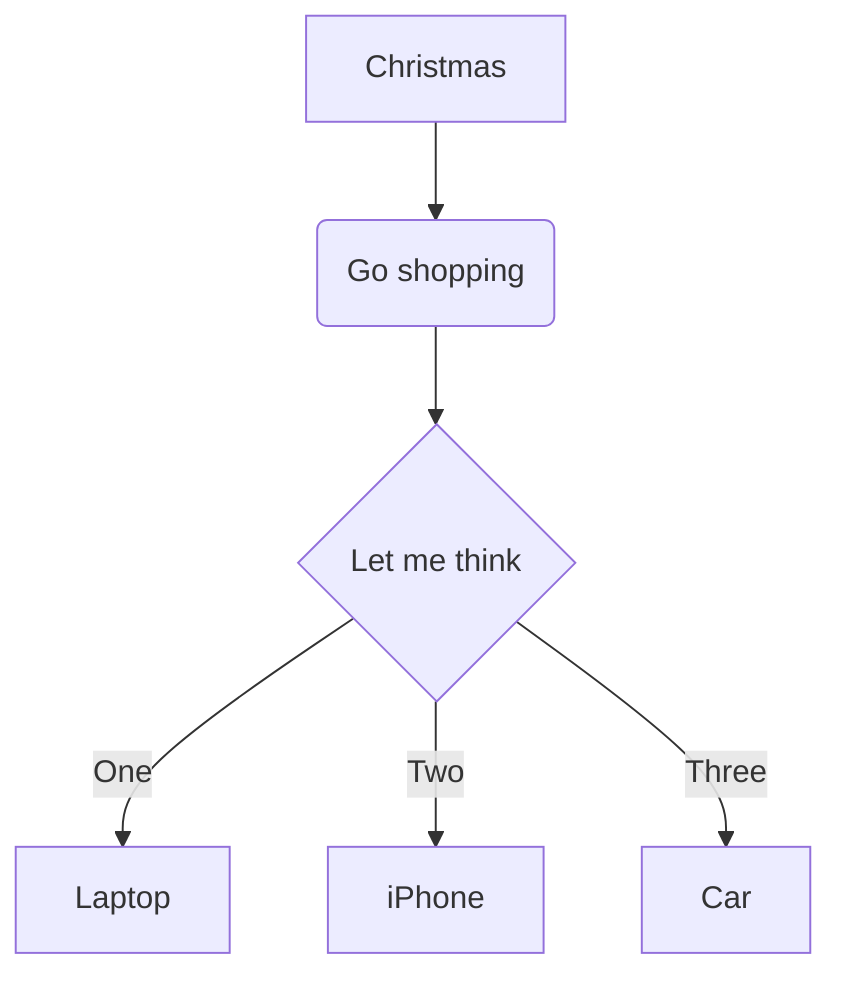

[TOC]
# Markdown教程

* Markdown是一种轻量级**标记语言**，它允许人们使用易读写的纯文本格式编写文档  
* Markdown语言在2004年由约翰·格鲁伯（John Gruber）创建  
* Markdown编写的文档可以导出**HTML、Word、图像、PDF、Epub**等多种格式的文档  
* Markdown编写的文档后缀为 .md，.markdown  
* Markdown能被使用来撰写电子书，如：Gitbook  
* 当前许多网站都广泛使用Markdown来撰写帮助文档或是用与论坛上发表消息。例如：GitHub、简书、reddit、Diaspora、Stack Exchange、OpenStreetMap、SourceForge等。  

## 标题
使用`=`和`-`标记一级和二级标题  
语法格式如下:   

```Markdown
我展示的是一级标题
==================
我展示的是二级标题
------------------
```

展示结果如下:


使用`#`号标记  
* 使用`#`号可表示1-6级标题，一级标题对应一个`#`号，二级标题对应两个`#`号，以此类推。  

```Markdown
# 一级标题
## 二级标题
### 三级标题
#### 四级标题
##### 五级标题
###### 六级标题
```

展示结果如下：  


* **温馨提示：** 使用`[toc]`标记编辑器会把所标题写到目录大纲中


## 段落
* Markdown段落没有特殊的格式，直接编写文字就好，段落的**换行**是使用**两个以上空格加上回车**  
* 当然也可以在段落后面使用一个空行来表示重新开始一个段落  

## 字体
Markdown可以使用以下几种字体：  

```Markdown
*斜体文字*
_斜体文字_  
**粗体文字**
__粗体文字__  
***粗斜体文字***
___粗斜体文字___
```

展示效果如下：  
*斜体文字*  
_斜体文字_  
**粗体文字**  
__粗体文字__  
***粗斜体文字***  
___粗斜体文字___

对于字体的大小Markdown本身是无能为力的，但由于markdown最终要转变为XTHML（或HTML）文档，因此，可以考虑用**HTML语言**结合**CSS**来排版解决这个问题。  
尝试如下：

    <p style="text-align:center;color:#1e819e;font-size:1.3em;font-weight:bold:">
    改变文字的大小、颜色和对齐方式
    </p>

展示结果如下：
<p style="text-align:center;color:#1e819e;font-sie:1.3em;font-weight:bold:">
改变文字的大小、颜色和对齐方式
</p>

详细内容请参见[使用有道云笔记的三个技巧](https://www.jianshu.com/p/e915c75f5f65 "使用有道云笔记的三个技巧")。

## 分割线
* 你可以在一行中用三个以上的**星号**、**减号**、**底线**来建立一个分割线，行内**不能**有其他东西。你也可以在星号或是减号中间插入空格。下每种写法都可以建立分割线：

```Markdown
***
* * *
******
- - -
-----------
```

展示效果如下：  
***
* * *
******
- - -
-----------

## 删除线
* 如果段落上的文字要添加删除线，只需要在文字的两端加上两个**波浪线**（~~）即可，释例如下：  

```Markdown
Green  
Blue 
~~Yellow~~
```

展示效果如下： 
Green 
Blue 
~~Yellow~~

## 下划线
下划线可以通过HTML的`<u>` 标签来实现：  

```HTML
<u>带下划线文本</u>  
```

展示效果如下：  
<u>带下划线文本</u>  

> **注**：尽量不要被文本加下划线，因为这会和超链的表现形式混淆，会被误以为是个超链  

## 脚注
脚注是对文本的补充说明。Markdown教主的格式如下：`[^要注明的文本]`  
以下实例演示了脚注的用法：  

```Markdown
创建脚注格式类似这样[^RUNOOB]
[^RUNOOB]: 菜鸟教程--学的不仅是技术，更是梦想！！！
```

展示效果如下：  
创建脚注格式类似这样[^RUNOOB]。

[^RUNOOB]:菜鸟教程--学的不仅是技术，更是梦想！！！

## 列表
* Markdown支持**有序列表**和**无序列表**。  
* 无序列表使用**星号**、**加号**或是**减号**作为列表标记：  

```Markdown
* 第一项
* 第二项
* 第三项
+ 第一项
+ 第二项
+ 第三项
- 第一项
- 第二项
- 第三项  
```

展示效果如下：  
* 第一项
* 第二项
* 第三项
+ 第一项
+ 第二项
+ 第三项
- 第一项
- 第二项
- 第三项

* 有序列表使用**数字加上.号**来表示，如：

```Markdown
1. 第一项
2. 第二项
3. 第三项
```

展示效果如下：  
1. 第一项、
2. 第二项
3. 第三项

### 列表嵌套
* 列表嵌套只需在子列表中的选项添加四个空格即可：  

```Markdown
1. 第一项    
    * 第一项嵌套的第一个元素  
    + 第一项嵌套的第二个元素
2. 第二项
    - 第二项嵌套的第一个元素
    - 第二项嵌套的第二个元素
```

展示效果如下：  
1. 第一项
    * 第一项嵌套的第一个元素
    
    + 第一项嵌套的第二个元素
2. 第二项
    - 第二项嵌套的第一个元素
    - 第二项嵌套的第二个元素

## 区块
* Markdown区块引用是在段落开头使用`>`符号，然后后面紧跟一个**空格**符号：  

```Markdown
> 区块引用  
> 菜鸟教程  
> 学的不仅是技术更是梦想  
```

展示效果如下：  
> 区块引用   
> 菜鸟教程  
> 学的不仅是技术更是梦想

* 另外区块是可以**嵌套**的，一个`>`符号是最外层，两个`>`符号是第一层嵌套，依此类推：

```Markdown
> 最外层
>> 第一层嵌套
>>> 第二层嵌套
```

展示效果如下：  
> 最外层
> > 第一层嵌套
> >
> > > 第二层嵌套

### 区块中使用列表
区块中使用列表实例如下：

```Markdown
> 区块中使用列表
> 1. 第一项
> 2. 第二项
> * 第一项
> + 第二项
> - 第三项
```

> 区块中使用列表
> 1. 第一项
> 2. 第二项
> * 第一项
> + 第二项
>
> - 第三项

### 列表中使用区块
如果要在列表项目内放进区块，那么就需要在`>`前添加**四个空格的缩进**。  
区块中使用列表实例如下：

```Markdown
* 第一项
    > 菜鸟教程
    > 学的不仅是技术更是梦想
* 第二项  
```

展示效果如下：  
* 第一项
    > 菜鸟教程 
    > 学的不仅是技术更是梦想
* 第二项

## 代码
* 如果是段落上的一个函数或片段的代码可以用**反引号**，例如：

```Markdown
`printf()`函数
```

展示效果如下： 
`printf()`函数

### 代码区块
代码区块使用**四个空格**或者一个**制表符（Tab键）**。 
实例如下：

```Markdown
    
    <?php  
    echo 'RUNOOB';  
    function test(){  
        echo 'test';  
    }
```

> **注意**：缩进式插入前方必须有空行；一个代码区会一直持续到没有缩进的那一行

展示效果如下：  

    <?php
    echo 'RUNOOB';
    function test(){
        echo 'test';
    }

* 你也可以用```包裹一段代码，并指定一种语言（也可以不指定）：  
  
```markdown
​```javascpript
$(document).ready(function () {
    alert('RUNOOB');
});
​```
```

展示效果如下：  

```javascript
$(document).ready(function () {
    alert('RUNOOB');
});
```
> **注意：** 对于代码块中的**反引号**,只要代码块中的反引号数量少于三个，就能直接在代码块中使用反引号而不用担心转义。但是，如果反引号的数量大于或等于三个，那么代码块的包裹就需要更多的反引号了。  
> 详细请参考[Markdown 如何在内联代码或者代码块中使用代码开始符号反引号（`）](https://blog.walterlv.com/post/markdown-code-escape-backtick.html
> )

## 链接
链接使用方法如下：

> [链接名称]（链接地址）  
> 或者  
> <链接地址>

例如：
`这是一个链接[菜鸟教程]（https://www.runoob.com)`    
显示结果如下：  
这是一个链接[菜鸟教程](https://www.runoob.com)  
直接使用链接地址：

    <https://www.runoob.com>

显示结果如下：  
<https://www.runoob.com>

### 高级链接
链接也可以用变量来代替，文档末尾附带变量地址：  

    这个链接用1作为网址变量[Baidu][1]
    这个链接用runoob作为网址变量[Runoob][runoob]
    然后再文档的末尾为变量赋值（网址）
    
    [1]:http://www.baidu.com/
    [runoob]:http://www.runoob.com/

显示结果如下：  
这个链接用1作为网址变量[Baidu][1]  
这个链接用runoob作为网址变量[Runoob][runoob]  
然后再文档的末尾为变量赋值（网址）  

[1]:http://www.baidu.com
[runoob]:http://www.runoob.com

## 图片
Markdown图片语法格式如下：

    ！[alt 属性文本](图片地址)
    
    ！[alt 属性文本](图片地址 "可选标题")

> * 开头一个**感叹号**！
> * 接着一个**方括号**，里面放上图片的替代文字  
> * 接着一个**圆括号**，里面放上图片的网址，最后还可以用**引号**包住并加上选择性的'title'属性的文字  

> **注解1：** 图片的Alt标签是用来描述图片的关键词，可以不写。最初的本意是当图片因为某种原因不能被显示是而出现的替代文字，后来又被用于SEO，可以方便搜索引擎根据Alt标签里的关键词搜索到图片。  
> **注解2：** 图片地址支持绝对路径和相对路径。但由于本地图片的路径更改或丢失都会造成markdown文件调不出图，因此建议使用网络图片。

使用实例：

    
    

显示结果如下：  
  
  
当然，你也可以像网址那样对图片网址使用变量：  

    这个链接用2作为网址变量[RUNOOB][2].  
    然后再文档的结尾变量赋值（网址）  


​    
​    [2]:http://static.runoob.com/images/runoob-logo.png

显示结果如下：  
这个链接用2作为网址变量[RUNOOB][2].  
然后在文档的结尾变量赋值（网址）  

[2]:http://static.runoob.com/images/runoob-logo.png

* Markdown还没有办法指定图片的高度和宽度，如果需要的话，可以使用HTML的`img`标签  


      

显示结果如下：  


* Markdown显示的图片默认都是左对齐，其自身也不支持图片位置的设定。同样，我们也可以使用HTML语法来实现：
* 如果只是居中对齐，则可以使用HTML中的`<center>···</center>`标签包围在Markdown图片链接内容的外面即可，如下：  

```HTML
<center>

</center>
```

展示效果如下：  
<center>

</center>

> **注意：** 该方式只能设置居中对齐，不能进行右对齐。而且`<center>`标签中间的链接只能使用HTML的语法格式，使用Markdown的图片语法似乎是无效的（网上一些资料显示是可以的，但是这里我没有实现。同样，网络上资料显示可以通过HTML语法中的`img`标签实现右对齐，例如：  

    <div align=right>
    
    </div>  
> 可能是编辑器的原因，在有些编辑器上可以实现这个功能，但是在有些编辑器上就不能实现这个功能，比如在有道云的Markdown编辑器上就无法实现，好像在CSDN博客上的Markdown编辑器可以实现，另外经过尝试在Notepad++上也可以实现这些语法。

### 将图片存入markdown文件
用base64转码工具把图片转成一段字符串，然后把字符串填到图片地址的位置。
* 基础用法：``  
这个时候会发现插入的这一长串字符串会把整个文章分割开，非常影响编写文章时的体验。如果能够把大段的base64字符串放在文章末尾，然后在文章中通过一个id来调用，文章就不会被分割的这么乱了。
* 高级用法
1. `![avatar][base64str]`
2. `[base64str]:data:image/png;base64,iVBORw0......`  

至于base64的图片码如何得来，请参考[MarkDown添加图片的三种方式](https://www.jianshu.com/p/280c6a6f2594)

## 表格
Markdown制作表格使用`|`来分隔不同的单元格，使用`-`来分隔表头和其他行。  
语法格式如下：

```Markdown
|   表头   |   表头   |
|   ----   |   ----   |
|  单元格  |  单元格  |
|  单元格  |  单元格  |
```

展示结果如下：  

| 表头   | 表头   |
| ------ | ------ |
| 单元格 | 单元格 |
| 单元格 | 单元格 |

### 对齐方式
* `-:`设置内容和标题栏居右对齐
* `:-`设置内容和标题栏居左对齐
* `:-:`设置内容和标题栏居中对齐

实例如下： 

```Markdown
|左对齐|右对齐|居中对齐|
|:----|----:|:----:|
|单元格|单元格|单元格|
|单元格|单元格|单元格|
```

展示结果如下：  

| 左对齐 | 右对齐 | 居中对齐 |
| :----- | -----: | :------: |
| 单元格 | 单元格 |  单元格  |
| 单元格 | 单元格 |  单元格  |

## 高级技巧
### 支持的HTML元素
不在Markdown涵盖范围之内的标签，都可以直接在文档里面用**HTML**撰写。  
目前支持的HTML元素有：`<kbd>` `<b>` `<i>` `<em>` `<sup>` `<sub>` `<br>`等。
> **注：** 该教程显示支持的HTML元素在有道云笔记中的Markdown中有些未能实现  
### 转义
Markdonw使用了很多特殊符号来表示特定的意义，如果需要特定的符号则需要使用转义字符，Markdown使用**反斜杠**转义特殊字符：

    **文本加粗**
    \*\* 正常显示星号 \*\*

展示效果如下：  
**文本加粗**  
\*\*正常显示星号\*\*  

* Markdown支持以下这些符号前面个加上**反斜杠**来帮助插入普通的符号：  

| 符号 |  中文名  |
| :--: | :------: |
|  \   |  反斜线  |
|  `   |  反引号  |
|  *   |   星号   |
|  _   |  下划线  |
|  {}  |  花括号  |
|  []  |  方括号  |
|  ()  |  小括号  |
|  #   |  井字号  |
|  +   |   加号   |
|  -   |   减号   |
|  .   | 英文句点 |
|  !   |  感叹号  |

## 公式
### 行内公式
在文本内容中使用，对于一些体积小的变量或者算式，使用`$...$`包围公式，例如：

    质能守恒方程可以用一个很简洁的方程式$E=mc^2$来表达

展示效果如下： 
质能守恒方程可以用一个很简洁的方程式$E=mc^2$来表达

### 公式块
使用`$$···$$`包围公式块,例如 

```markdown
$$
\mathbf{V}_1 \times \mathbf{V}_2 =   
\begin{vmatrix}  
\mathbf{i} & \mathbf{j} & \mathbf{k} \\
\frac{\partial X}{\partial u} & \frac{\partial Y}{\partial u} & 0 \\
\frac{\partial X}{\partial v} & \frac{\partial Y}{\partial v} & 0 \\
\end{vmatrix}
$$
```

展示效果如下：

$$
\mathbf{V}_1 \times \mathbf{V}_2 =
\begin{vmatrix}
\mathbf{i} & \mathbf{j} & \mathbf{k} \\
\frac{\partial X}{\partial u} & \frac{\partial Y}{\partial u} & 0 \\
\frac{\partial X}{\partial v} & \frac{\partial Y}{\partial v} & 0 \\
\end{vmatrix}
$$

### 常用公式
#### 运算符

|   符号   |   代码   |
| :------: | :------: |
|   $+$    |    +     |
|   $-$    |    -     |
|  $\pm$   |  `\pm`   |
| $\oplus$ | `\oplus` |
| $\cdot$  | `\cdot`  |
| $\times$ | `\times` |
|  $\div$  |  `\div`  |
| $\prod$  | `\prod`  |

#### 函数符

|      符号     |            代码            |
| :------------:| :------------------------: |
|     $\ln$     |            \ln             |
|     $lg$      |            \lg             |
|  $\log_a{b}$  |         \log_a{b}          |
|  $\sqrt{x}$   |          \sqrt{x}          |
| $\sqrt[3]{x}$ |        \sqrt[3]{x}         |
|    $\sin$     |            \sin            |
|    $\cos$     |            \cos            |
|    $\tan$     |            \tan            |
|    $\cot$     |            \cot            |
|     $a^x$     |            a^x             |
|    $\max$     |            \max            |
|    $\min$     |            \min            |
| $\frac{a}{b}$ | \frac{a}{b} or {a \over b} |

#### 大小关系

|   符号   |      代码      |
| :------: | :------------: |
|   $=$    |       =        |
| $\equiv$ |    `\equiv`    |
|   $<$    | <   或   `\lt` |
|   $>$    | >   或   `\gt` |
|  $\geq$  |     `\geq`     |
|  $\leq$  |     `\leq`     |
|  $\neq$  | `\neq`or`\ne`  |

#### 逻辑集合

|    显示      |       输入方式       |
|:-----------:| :-----------------: |
|  $\empty$   |`\emptyset`or`\empty`|
|    $\in$    |   `\in`or`\isin`    |
|  $\notin$   |      `\notin`       |
|  $\supset$  |      `\supset`      |
| $\supseteq$ |     `\supseteq`     |
|  $\subset$  |      `\subset`      |
| $\subseteq$ |     `\subseteq`     |
|   $\cup$    |       `\cup`        |
|   $\cap$    |       `\cap`        |
|  $\forall$  |      `\forall`      |
|  $\exists$  |      `\exists`      |
|   $\lnot$   |       `\lnot`       |
|  $\implies$ |     `\implies`     |
|    $\iff$   |       `\iff`        |
|   $\alef$   |  `\alef`or`\aleph`  |

####  括号

|           显示            |       输入方式        |
| :-----------------------: | :-------------------: |
| $\lbrack \quad \rbrack$ | [] or \lbrack \rbrack |
| $\lbrace \quad \rbrace$ | {} or \lbrace \rbrace |
| $\langle \quad \rangle$ | <> or \langle \rangle |
| $\lceil \quad \rceil$ |     \lceil \rceil     |
| $\lfloor \quad \rfloor$ |    \lfloor \rfloor    |

* **注：** 括号的的大小可以使用`\big` 、`\Big`、`\bigg`、`\Bigg` 、`\left`、`\middle`、`\right`等进行调整。

#### 向量

|          显示         |      输入方式       |
| :-------------------: | :-----------------: |
|       $\vec a$        |       \vec a        |
| $\overrightarrow{xy}$ | \overrightarrow{xy} |
| $\overline{AB}$|\overline{AB}|

#### 微积分

|          符号          |         代码         |
| :--------------------: | :------------------: |
|         $\int$         |         \int         |
| $\lim\limits_{x\to 0}$ | 行内使用`\lim\limits_{x\to 0}` ，行间使用`\lim_{x\to 0}` |
|        $\infty$        |        \infty        |
|        $\nabla$        |        \nabla        |
|       $\partial$       |       \partial       |
|        $\oint$         |        \oint         |
|       $\oiint$        |         \oiint        |
|       $\oiiint$        |         \oiiint      |

#### 矩阵
##### 基本语法
起始标记`\begin{matrix}`,结束标记`\end{matrix}`，每一行末尾标记`\\`，行间元素之间以`&`分隔：

    $$
    \begin{matrix}
    1 & 0 & 0 \\
    0 & 1 & 0 \\
    0 & 0 & 1 
    \end{matrix}
    $$

展示效果如下：

$$
\begin{matrix}
1 & 0 & 0 \\
0 & 1 & 0 \\
0 & 0 & 1
\end{matrix}
$$

##### 矩阵边框
在起始、结束标记处用下列词替换`matrix`:

|    代码     |    含义    |
| :---------: | :--------: |
| `$pmatrix$` | 小括号边框 |
| `$bmatrix$` | 中括号边框 |
| `$Bmatrix$` | 大括号边框 |
| `$vmatrix$` | 单竖线边框 |
| `$Vmatrix$` | 双竖线边框 |

##### 省略元素

|    符号  |  代码  |
| :------: | :----: |
| $\cdots$ | \cdots |
| $\vdots$ | \vdots |
| $\ddots$ | \ddots |

实例如下：

    $$
    \begin{bmatrix}
    a_{11} & a_{12} & \cdots & a_{1n} \\
    a_{21} & a_{22} & \cdots & a_{2n} \\
    \vdots & \vdots & \ddots & \vdots \\
    a_{m1} & a_{m2} & \cdots & \a_{mn} \\
    \end{bmatrix}
    $$

展示效果如下：
$$
\begin{bmatrix}
a_{11} & a_{12} & \cdots & a_{1n} \\
a_{21} & a_{22} & \cdots & a_{2n} \\
\vdots & \vdots & \ddots & \vdots \\
a_{m1} & a_{m2} & \cdots & a_{mn}
\end{bmatrix}
$$

##### 阵列
* 需要`array`环境：起始、结束处以`{array}`声明
* 对齐方式：在`{array}`后以`{}`逐行统一声明
    * 左对齐：`1`；居中：`c`;右对齐：`r`
    * 竖直线：在声明对齐方式时，插入`|`建立竖直线
* 插入水平线：`\hline`

实例如下：

    $$
    \begin{array}{c|}
    {↓} & {a} & {b} & {c} \\
    \hline
    {R_1} & {c} & {b} & {a} \\
    {R_2} & {b} & {c} & {c}
    \end{array}
    $$

展示效果如下：
$$
\begin{array}{c|}
{↓} & {a} & {b} & {c} \\
\hline
{R_1} & {c} & {b} & {a} \\
{R_2} & {b} & {c} & {c} 
\end{array}
$$

#### 方程组
* 需要`cases`环境：起始、结束处以`{cases}`声明

实例如下：

    $$
    \begin{cases}
    a_1x+b_1y+c_1z=d_1 \\
    a_2x+b_2y+c_2z=d_2 \\
    a_3x+b_3y+c_3z=d_3
    \end{cases}
    $$

展示效果如下：

$$
\begin{cases}
a_1x+b_1y+c_1z=d_1 \\
a_2x+b_2y+c_2z=d_2 \\
a_3x+b_3y+c_3z=d_3
\end{cases}
$$

#### 常用希腊字母

|     显示   | 输入方式 |    显示  | 输入方式 |
| :--------: | :------: | :------: | :------: |
|  $\alpha$  |  \alpha  | $\beta$  |  \beta   |
|  $\gamma$  |  \gamma  | $\delta$ |  \delta  |
| $\epsilon$ | \epsilon | $\zeta$  |  \zeta   |
|   $\eta$   |   \eta   | $\theta$ |  \theta  |
|  $\iota$   |  \iota   | $\kappa$ |  \kappa  |
| $\lambda$  | \lambda  |  $\mu$   |   \mu    |
|   $\nu$    |   \nu    |  $\xi$   |   \xi    |
|   $\pi$    |   \pi    |  $\rho$  |   \rho   |
|  $\sigma$  |  \sigma  |  $\tau$  |   \tau   |
| $\upsilon$ | \upsilon |  $\psi$  |   \psi   |
|  $\omega$  |  \omega  | $\Gamma$ |  \Gamma  |
| $\omicron$ | \omicron |  $\phi$  |   \phi   |
|   $\chi$   |   \chi   |$\varepsilon$|\varepsilon|
|$\varkappa$ |\varkappa |$\vartheta$|\vartheta|
|$\thetasym$ |\thetasym | $\varpi$ |  \varpi  |
|  $\varrho$ | \varrho  |$\varsigma$|\varsigma |
|  $\varphi$ | \varphi  |$\digamma$|\digamma  |

* 大写希腊字母首字母大写，斜体希腊字母在命令前加上var前缀即可。

#### 其它符号

|  显示  |             输入方式             |
| :----: | :------------------------------: |
| $\ell$ | `\ell` |
| $\overset{!}{=}$ |       `\overset{!}{=}`       |
|$\underset{!}{=}$|`\underset{!}{=}`|
|$\xlongequal[y=b]{x=a}$|`\xlongequal[y=b]{x=a}`|
|$\xrightarrow[under]{over}$|`\xrightarrow[under]{over}`|
|$\underbrace{a+b+c}_{note}$|`\underbrace{a+b+c}_{note}`|
|$\overbrace{a+b+c}_{note}$|`\overbrace{a+b+c}_{note}`|
| $\displaystyle\sum_{i=1}^n$ |               行间使用`\sum ` ，行内使用`\displaystyle\sum_{i=0}^n`               |
|$\displaystyle\prod_{k=1}^n$|`\dispalystyle\prod_{k=1}^n`|
|$\odot$|              `\odot`              |
|$\ddot{a}$|          `\ddot{a}`            |
|$\perp$|              `\perp`              |
|  空格  |              `\quad`              |
|  文本  | `\mathtt{if}` 和 `\mathbf{if}`(黑体) |
| $\sim$ | `\sim` |
| $\backsim$ | `\backsim` |

更多公式请参见[Supposed Functions](https://katex.org/docs/supported.html).

## 图表
### 待办和清单
在Markdown中，你只需要在待办的事项文本或者清单文本前加上 `-[]`、`[x]`即可。 
其中`-[]`表示未完成，`-[x]`表示已完成。
**注：** 键入字符与字符之间都要保留一个字符的空格
实例如下：  

    - [x] 已完成项目1
      - [x] 已完成事项1
      - [x] 已完成事项2
    - [] 待办事项1
    - [] 待办事项2

展示效果如下： 

- [x] 已完成项目1
  - [x] 已完成事项1
  - [x] 已完成事项2
- [ ] 待办事项1
- [ ] 待办事项2 

### Flowchart 流程图

一个简单的小例子：

```
st=>start: Start
op=>operation: Your Operation
cond=>condition: Yes or No?
e=>end

st->op->cond->e
cond(yes)->e
cond(no)-op
```

效果如下：

```flow
st=>start: Start
op=>operation: Your Operation
cond=>condition: Yes or No?
e=>end

st->op->cond
cond(yes)->e
cond(no)->op
```

#### 定义元素

```
tag=>type: content:>url
```

* tag 就是元素名字
* type 就是这个元素的类型，有 6 中类型，分别为
	* start 开始
	* end 结束
	* operation 操作
	* subroutine 子程序
	* condition 条件
	* inputoutput 输入或产出
* content 就是在框中要写的内容，注意 type 后的冒号与文本之间一定要有个空格。
* url 是一个链接，与框中的文本相绑定

#### 连接元素

用 `->` 来连接两个元素，需要注意的是condition类型，因为它有 yes 和 no 两个分支，所以要写成

```
c2(yes)->io>2
c2(no)->op2-e
```

一个比较复杂的例子：

```flow
st=>start: Start|past:>http://www.google.com[blank]
e=>end: End:>http://www.google.com
op1=>operation: get_hotel_ids|past
op2=>operation: get_proxy|current
sub1=>subroutine: get_proxy|current
op3=>operation: save_comment|current
op4=>operation: set_sentiment|current
op5=>operation: set_record|current

cond1=>condition: ids_remain空?
cond2=>condition: proxy_list空?
cond3=>condition: ids_got空?
cond4=>condition: 爬取成功??
cond5=>condition: ids_remain空?

io1=>inputoutput: ids-remain
io2=>inputoutput: proxy_list
io3=>inputoutput: ids-got

st->op1(right)->io1->cond1
cond1(yes)->sub1->io2->cond2
cond2(no)->op3
cond2(yes)->sub1
cond1(no)->op3->cond4
cond4(yes)->io3->cond3
cond4(no)->io1
cond3(no)->op4
cond3(yes, right)->cond5
cond5(yes)->op5
cond5(no)->cond3
op5->e
```

### Mermaid 流程图

一段流程图语法以`` ` ``开头，以`` ` ``结尾。 
在`` ` ``后另起一行，书写`graph XX`，用以确定将要绘制的流程图及其类型（`XX`表示流程图类型）。 
流程图分为**横向**和**竖向**两大类，竖向包括**自上而下**和**自下而上**两种顺序，横向包括**从右到左**和**从左到右**两种顺序。 
其对应语法分别为：`graph TB`、`graph BT`、`graph RL`、`graph LR`。

|   顺序   | 语法 |
| :------: | :--: |
| 自上而下 | `TB` |
| 自下而上 | `BT` |
| 从右到左 | `RL` |
| 从左到右 | `LR` |

实例如下：  

```
graph TD
    A[Christmas] -->B(Go shopping)
    B --> C{Let me think}
    C --> |One| D[Laptop]
    C --> |Two| E[iPhone]
    C --> |Three| F[Car]
```

展示效果如下：



仔细研究上述案例，会发现，我们可以通过**调整语法**来**调整流程图的框线、连接线**，不同条件能导向不同结果。

#### 对框线形状的调整

```
graph LR
    A[这是直角四边形]
```


    graph LR
    A((这是圆形))


    graph LR
    A{这是菱形}


#### 对箭头的调整

    graph LR
    A[A]---B[B]


    graph LR
    A[A]-->B[B]


    graph LR
    A[A]-->|插入文本|B[B]


### 甘特图
有流程图一样，Markdown中，甘特图的语法也是以`` ` ``开头，以`` ` ``结尾。  
在`` ` ``后另起一行，书写`gantt`，用以确定将要绘制的时甘特图。  
标题的书写语法如下：  

    ```
    gantt
    dateFormat YYYY-MM-DD
    title 产品计划表

**注：** dateFormat YYYY-MM-DD规定了时间轴，title（标题文本）表示甘特图标题。  
如需按项目进行划分，需键入`section`，空一个字符，再输入项目名称的文本（一个`section`和另一个`section`之间要空行）。
每个大项目将要拆解为若干个小任务，只需再`section`之后另起一行，直接输入小项目名称即可。  
实例如下：  

    ```
    gantt
    dataFormat YYYY-MM-DD
    title 产品计划表
    section 初期阶段
    明确需求：2016--03-01，10d
    section 中期阶段
    跟进开发：2016-03-11，15d
    section 后期阶段
    走查测试：2016-03-20，9d
    ```

```
gantt
dateFormat YYYY-MM-DD
title 产品计划表
section 初期阶段
明确需求:2016-03-01,10d
section 中期阶段
跟进开发:2016-03-11,15d
section 后期阶段
走查测试:2016-03-20,9d
```
详细内容请参见 [[进阶版]有道云笔记Markdown指南](http://note.youdao.com/iyoudao/?p=2445)

