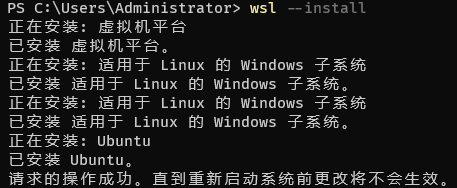
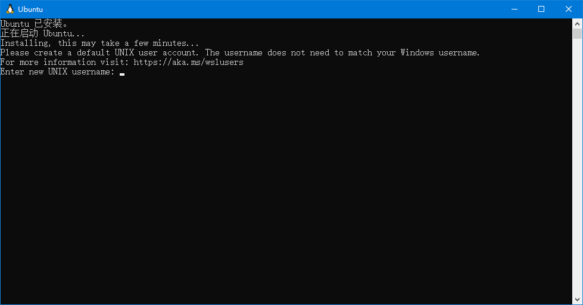

# WSL2 的安装

根据微软的官方文档 [使用 WSL 在 Windows 上安装 Linux](https://learn.microsoft.com/zh-cn/windows/wsl/install#step-1---enable-the-windows-subsystem-for-linux), 现在在 Windows 上安装 WSL 只需要在 PowerShell 或 Windows 命令提示符使用如下命令

```powershell
wsl --install
```

运行如图所示



根据提示重启计算机后, WSL 会自动启动



依次输入创建的用户名和密码, 就成功的登入了 WSL 系统.

# WSL 迁移

WSL2 的磁盘文件默认存储在 C 盘, 位于 `C:\Users\UserName\AppData\Local\Packages\` 文件夹中, 可以从中找到一个含 `Ubuntu` 的文件夹. 当在 WSL 中安装大量软件时, 这对 C 盘的磁盘容量是一个巨大考验. 所以考虑将其迁移至 D 盘.

如果 WSL 还在运行的话需要在 PowerShell 或 Windows 命令提示符中输入

```powershell
wsl --shutdown
```

关闭后可以通过 `wsl -l -v` 命令查看状态. 确定关闭了 WSL, 便可以导出子系统的文件

```powershell
wsl --export Ubuntu D:\WSL2tar
```

其中 `--export` 选项后的第一个参数表示子系统的名称, 这个可以在前面 `wsl -l -v` 这个命令中看到. 后面跟的路径名称便是导出文件存储的名称.

导出成功后, 可以把原来的子系统注销

```powershell
wsl --unregister Ubuntu
```

注销成功, 再将子系统的文件导入到新的位置, 如 `D:\WSL2`

```powershell
wsl --import Ubuntu D:\WSL2 D:\WSL2tar
```

这样迁移过程就完成了, 重新启动便能运行.

但这样直接打开子系统会以 `root` 用户运行, 如果之前不是使用的 `root` 用户会找不到原来的文件. 所以需要设置默认用户

```powershell
Ubuntu config --default-user username
```

现在打开终端, 便会回到之前使用的用户了.

以上过程参考 [2.迁移wsl2子系统文件目录](https://juejin.cn/post/7024498662935904269).


# 包管理工具

WSL2 安装的是 Ubuntu 系统, 使用 `apt` 这一包管理工具.

想要查找可以安装的软件包可使用如下命令

```bash
apt search package_name
```

如果想要显示软件包的详细信息, 使用如下命令

```bash
apt show package_name
```

以上内容参考 [Ubuntu系统如何搜索要安装的软件包](https://blog.csdn.net/aaa123524457/article/details/96865138).

# USB 设备

我的电脑有两个盘, 平时使用 USB 设备存储一些文件, 但是 WSL2 默认不显示 USB 设备, 这需要挂载 USB 设备.

1. 首先建一个用来挂载 USB 设备里面文件的文件夹

```bash
sudo mkdir /mnt/e
```

2. 挂载

```bash
sudo mount -t drvfs E: /mnt/e
```

这样就可以在 WSL2 中访问 USB 设备了.

这一部分内容参考 [WSL2挂载USB设备](https://blog.csdn.net/qq_59475883/article/details/123314000).

# Neovim

[Neovim](./Neovim.md) 是一份 Neovim 的简易教程. 这里主要说明如何将 Neovim 中使用 `yy` 快捷键复制的内容添加到 Windows 系统的剪贴板中, 即 WSL2 中的 Neovim 和 Windows 剪贴板之间的通信.

参考 [Wsl的nvim与Windows系统剪切板通信](https://zhuanlan.zhihu.com/p/450705959) 这一篇文章, 只需要将以下命令添加到配置文件中:

```lua
if vim.fn.has('wsl') then
  vim.cmd [[
  augroup Yank
  autocmd!
  autocmd TextYankPost * :call system('/mnt/c/windows/system32/clip.exe ',@")
  augroup END
  ]]
end
```

参考 [从零开始配置 vim(11)——插件管理](https://zhuanlan.zhihu.com/p/551941252) 这一篇文章, 将上述配置使用 Neovim 提供的 API 进行转换:

```lua
if vim.fn.has("wsl") then
    local yank = vim.api.nvim_create_augroup("YANK", { clear = true })
    vim.api.nvim_create_autocmd({ "TextYankPost " }, {
        pattern = "*",
        group = yank,
        command = ":call system('/mnt/c/windows/system32/clip.exe ', @\")"
    })
end
```

这样就实现了 WSL2 中的 Neovim 与 Windows 剪贴板的通信.

Neovim 的配置文件见 [WSL2Neovim](https://github.com/RunfengTsui/WSL2Neovim).

# Error

1. 错误代码 `Wsl/Service/CreateInstance/0x80040326` 导致无法正常启动子系统. 根据 [Issue #9867](https://github.com/microsoft/WSL/issues/9867), 在 PowerShell 中使用 `wsl --update` 更新子系统即可解决.

2. `/usr/lib/wsl/lib/libcuda.so.1 is not a symbolic link`

参考 [/usr/lib/wsl/lib/libcuda.so.1 is not a symbolic link](https://blog.csdn.net/u011715038/article/details/113733006), `/usr/lib/wsl/lib/` 目录下都是文件而不是链接, 且该目录只读, 只能移到其他目录操作.

```bash
cd /usr/lib/wsl
sudo mkdir lib2
sudo ln -s lib/* lib2
sudo ldconfig
```

然后编辑文件 `/etc/ld.so.conf.d/ld.wsl.conf` 中的 `/usr/lib/wsl/lib` 修改为 `/usr/lib/wsl/lib2` 即可.

不过更改链接路径在更新驱动之后需要重新链接, 否则 `lib2` 中和 `lib` 中不一致从而导致 WSL 中不可使用 Windows 下的驱动.

以上操作在重启 WSL 会自动还原, 想要不被还原, 还需要修改 `/etc/wsl.conf` 中的设置 `ldconfig` 为 `false`. 这其实在 `/etc/ld.so.conf.d/ld.wsl.conf` 文件中有提示

```
# This file was automatically generated by WSL. To stop automatic generation of this file, add the following entry to /etc/wsl.conf:
# [automount]
# ldconfig = false
```
