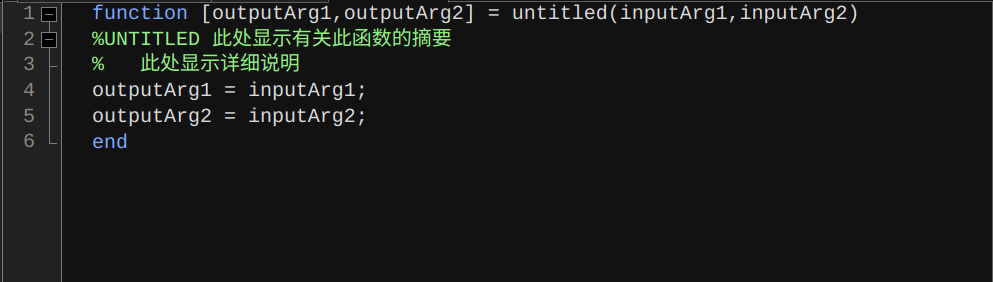

---
Title: Neovim 使用 LuaSnip 编写函数定义代码段的过程
Author: 邱彼郑楠
Date: 2023-11-24
Modified: 2023-12-01
Category: Neovim
Tags: Neovim, LuaSnip
--

[LuaSnip](https://github.com/L3MON4D3/LuaSnip) 展示了一些很棒的代码段, 其中有一个 Python 的代码段 [Function definition with dynamic virtual text](https://github.com/L3MON4D3/LuaSnip/wiki/Cool-Snippets#function-definition-with-dynamic-virtual-text) 可以将函数定义展开为不带函数说明, 带有简短说明和带有详细说明这三种情况. 每种情况配有相应的一段文字说明处于哪种情况, 而且当跳转到下一个节点时文字说明会自动消失.

于是, 我想写一段 Matlab 的函数定义代码段, 同样也可以展开为上述三种情况.

Matlab 新建函数文件的格式如下图所示, 带有详细参数说明的格式将以下图为蓝本.



使用 [FMT](https://github.com/L3MON4D3/LuaSnip/blob/master/DOC.md#fmt) 函数使代码结构更简洁

```lua
local ls = require("luasnip")
local s = ls.snippet
local fmt = require("luasnip.extras.fmt").fmt

s("function", fmt([[
  function [{outputs}] = {functioname}({inputs})
  {doc}
      {body}
  end
]], {nodes}))
```

## 最简单版本

对于前面给出的 `fmt` 函数, 需要分别填充 `nodes` 里面的 `outputs`, `functioname`, `inputs`, `doc` 和 `body` 这几个节点, 其中 `outputs`, `functioname`, `inputs`, `body` 这四个节点都可以直接设置成插入节点, 由用户自己输入内容, 可以给出默认文本. 即

```lua
local i = ls.insert_node

outputs = i(1, "outputs")
functioname = i(2, "untitled")
inputs = i(3, "inputs")
body = i(0)
```

然后对于剩下的 `doc` 节点, 即函数说明这部分, 前面已经说明要分为三种情况, 这需要使用 `choice_node` 将所有可能的情况列举出来:

```lua
local c = ls.choice_node
local sn = ls.snippet_node

doc = c(4, {
  t(''),          -- 无注释说明
  sn(1, nodes1),  -- 简短说明
  sn(2, nodes2),  -- 详细说明
})
```

> **注意**: 选择节点的使用需要提前配置好快捷键, 具体内容参见 [Keymaps](https://github.com/L3MON4D3/LuaSnip#keymaps).

### 详细函数文件说明

对于一个详细的函数文件说明, 要有摘要性质的描述, 有输入参数和输出参数的描述. 简单起见, 所有节点都设置成插入节点.

```lua
-- Note we need to surround the `fmt` with `sn` to make this work.
sn(2, fmt([[
  %{FUNCTIONAME} - {desc}
  %
  % Inputs:
  %   {args}
  %
  % Outputs:
  %   {returns}
  %
]], {
      FUNCTIONAME = i(1, "UNTITLED"),
      desc = i(2, "Here are some abstract about the function"),
      args = i(3),
      returns = i(4),
  }
)),
```

### 简短函数说明

而对于简短的函数说明, 只需要有摘要性质的描述即可, 输入参数和输出参数的描述就可以舍弃了.

```lua
sn(1, fmt([[
  %{FUNCTIONAME} - {desc}
  %
]], {
      FUNCTIONAME = i(1, "UNTITLED"),
      desc = i(2, "Here are some abstract about the function"),
  }
)),
```

这样就有了 `function` 这个代码段的雏形, 是可以正常的使用的一个版本. 但是每个节点都需要自己手动输入, 还是有些不方便的, 还有一些细节需要修改.

## 函数名的选择

Matlab 的函数名其实有两种情况:

* **函数文件**. 函数文件要保证文件名和函数名一致. 使用 Neovim 编辑函数文件自然已经有了文件名, 那么是否可以根据文件名来自动修改函数名呢?

* **脚本文件**. 脚本文件中可以创建多个函数, 这时候函数名就不需要和文件名保持一致了, 可以自己随意取定函数名.

所以 `functioname` 这个位置应该设置一个 `ChoiceNode`, 一个是插入节点, 默认值为 `untitled`; 另一个需要获取当前文件名并进行填充.

当前函数文件名可以通过 `vim.api.nvim_buf_get_name(0)` 得到, 这样得到的文件名是包含路径的, 所以还需要使用正则表达式将真正的文件名提取出来.

而提取文件名的过程需要使用 `function_node`, 它可以根据其他节点的内容, 使用自定义的函数来插入文本.

具体的节点如下:

```lua
local f = ls.function_node

functioname = c(2, {
  i(1, "untitled"),
  f(function ()
    local filename = vim.api.nvim_buf_get_name(0)
    return string.match(filename, ".+/(.+)%.m")
  end, {}),
}),
```

只需要将前面最简单版本中相对应节点替换为现在的节点即可.

## 注释中函数名大写

对于注释内容中的 `FUNCTIONAME` 节点, 其内容一般是函数名的全大写. 之前的版本中采用的是插入节点, 默认值为默认函数名 `untitled` 的全大写 `UNTITLED`. 如果修改了函数名, 那么就需要手动将全大写的文件名输入一遍, 是非常不方便的.

所以理想的情况是自动获取 `functioname` 这个节点的函数名, 并将其转化成大写形式传给 `FUNCTIONAME`. 这还是使用函数节点.

```lua
local ai = require("luasnip.nodes.absolute_indexer")

FUNCTIONAME = f(function (args)
  return string.upper(args[1][1])
end, { ai[2] })
```

函数很简单, 直接返回传入节点的大写形式即可, 这里需要注意的是 `string.upper()` 函数是处理字符串的. 而传入的参数 `args[1]` 是一个 `table` 类型的节点, `args[1][1]` 才是该节点的所包含的字符串内容. 

下面需要讨论的是传入给函数节点的参数, 也就是如何将 `functioname = c(2, choices)` 这个节点传入给函数节点.

### 节点引用

根据 [Node Reference](https://github.com/L3MON4D3/LuaSnip/blob/master/DOC.md#node-reference), 推荐了三种节点引用的方法:

`number` 这种节点引用方式十分具有局限性, 只有具有相同的父节点的节点才能被引用. 这里 `FUNCTIONAME` 这个节点是属于 `sn` 的, 而 `sn` 又在 `doc = c(4, choices)` 这个节点下, 至于要引用的节点 `functioname` 和 `doc` 是兄弟节点, 显然是不能直接通过 `number` 这种节点引用方式的.

`absolute_indexer` 这种绝对索引的方式是将这个代码段的所有节点都进行了标号, 那么就可以通过这个标号来访问任意一个节点. 上面给出的方式就是通过绝对索引来实现的, `functioname` 这个节点在整个代码段中处于第二个, 所以可以通过 `ai[2]` 索引到它. 至于如何找准节点的位置可以参考中文文档的 [Absolute_Indexer](https://zjp-cn.github.io/neovim0.6-blogs/nvim/luasnip/doc1.html#absolute_indexer) 部分.

#### 关键词索引

关键词索引的方式首先需要给被索引的节点一个记号. 根据 [Node](https://github.com/L3MON4D3/LuaSnip/blob/master/DOC.md#node) 中的说明, 节点的 `opts` 参数是可以通过设置 `key` 来使其被索引到. 因此, 给 `functioname` 这个节点再加入一个参数:

```lua
functioname = c(2, {
  i(1, "untitled"),
  f(function ()
    local filename = vim.api.nvim_buf_get_name(0)
    return string.match(filename, ".+/(.+)%.m")
  end, {}),
}, { key = "c2-key" })
```

然后传给函数节点

```lua
local k = require("luasnip.nodes.key_indexer").new_key

FUNCTIONAME = f(function (args)
  return string.upper(args[1][1])
end, k("c2-key"))
```

这样同样可以实现想要的功能.

## 参数列表

现在想实现的功能是根据输入参数和输出参数, 自动在注释中初始化参数列表, 这个在 Python 中有类似的实现, 参见 [init function with dynamic initializer list](https://github.com/L3MON4D3/LuaSnip/wiki/Cool-Snippets#init-function-with-dynamic-initializer-list).

也就是说, 在 `outputs` 和 `inputs` 那里, 我们输入了多个参数, 首先需要将这些参数都识别出来, 然后在参数描述那一部分一一列出来. 同时对每个参数的描述是可以修改的, 即参数描述使用插入节点.

这个时候需要使用 [DynamicNode](https://github.com/L3MON4D3/LuaSnip/blob/master/DOC.md#dynamicnode), 和函数节点的用法比较类似, 但是函数节点只能返回文本, 动态节点功能更加强大, 可以返回一段代码段.

下面来实现将参数展开成描述的列表这个功能函数:

```lua
local function expand_arguments(args)
  -- 定义一个空 table 类型的变量用来存储所有的节点
  local tab = {}
  -- 获取传入节点的文本字符串
  local a = args[1][1]
  -- 用来标记第几个插入节点
  local n = 1
  -- 用 , 将传入的字符串分隔成每一个参数, 参考的示例
  for e in string.gmatch(a, " ?([^,]*) ?") do
    -- #e 是指 e 的长度
    if #e > 0 then
      -- 将节点都插入到 tab 中
      table.insert(tab, t({"", "%   "}))
      table.insert(tab, t(e .. " - "))
      table.insert(tab, i(n, "Here are some descriptions about the parameter " .. e))
      n = n + 1
    end
  end
  -- 返回最后构造出来的代码段
  return sn(nil, tab)
end
```

那么, 便可以将 `args` 和 `returns` 这两个节点更换为使用上述函数的动态节点, 其中给 `args` 传入的是 `inputs` 这个节点的文本内容, 即采用绝对索引的方式是 `ai[3]`; 对应的, 给 `returns` 传入的是 `outputs` 这个节点的文本内容, 绝对索引为 `ai[1]`.

```lua
args = d(2, expand_arguments, { ai[3] }),
returns = d(3, expand_arguments, { ai[1] }),
```

这里有一个小细节, 由于 `tab` 这个变量首先插入的就是 `t({"", "%   "})`, 即直接换行插入一些文本. 所以之前的 `fmt` 需要将 `args` 和 `returns` 分别放到上一行不留空格, 即

```lua
sn(2, fmt([[
  %{FUNCTIONAME} - {desc}
  %
  % Inputs:{args}
  %
  % Outputs:{returns}
  %
]], {}))
```

## 无限注释

在 LaTeX 中有一个 [Endless List](https://github.com/L3MON4D3/LuaSnip/wiki/Cool-Snippets#endless-list) 可以输入含任意多个元素的列表. 而在本例中, `desc` 只是对函数简短的描述, 如果想要更详细的描述, 是不是也可以来一个无限注释呢.

所谓的无限, 就是所有的节点都是一个选择节点, 可以选择到此结束, 或者继续是一个新的选择节点. 这个实际上只需要更改无限列表中的文本字符串即可轻易实现:

```lua
local function rec_comment ()
  return sn(nil, {
    c(1, {
      -- important!! Having the sn(...) as the first choice will cause infinite recursion.
      t({""}),
      -- The same dynamicNode as in the snippet (also note: self reference).
      sn(nil, {t({"", "% "}), i(1), d(2, rec_comment, {})}),
    }),
  });
end
```

然后给 `desc` 这个节点添上由 `rec_ls` 这个函数生成的子节点即可:

```lua
desc = sn(1, {
    i(1, "Here are some abstract about the function."),
    d(2, rec_comment, {}),
}),
```

## 完整的代码

最后完整的代码段版本为, 保存为文件 `matlab.lua`. 根据 [Loaders Lua](https://github.com/L3MON4D3/LuaSnip/blob/master/DOC.md#lua) 的提示将其导入.

```lua
local ls = require("luasnip")
local s = ls.snippet
local sn = ls.snippet_node
local i = ls.insert_node
local t = ls.text_node
local c = ls.choice_node
local f = ls.function_node
local d = ls.dynamic_node
local fmt = require("luasnip.extras.fmt").fmt
local ai = require("luasnip.nodes.absolute_indexer")

local function expand_arguments(args)
  local tab = {}
  local a = args[1][1]
  local n = 1
  for e in string.gmatch(a, " ?([^,]*) ?") do
    if #e > 0 then
      table.insert(tab, t({"", "%   "}))
      table.insert(tab, t(e .. " - "))
      table.insert(tab, i(n, "Here are some descriptions about the parameter " .. e))
      n = n + 1
    end
  end
  return sn(nil, tab)
end

local function rec_comment ()
  return sn(nil, {
    c(1, {
      t({""}),
      sn(nil, {t({"", "% "}), i(1), d(2, rec_comment, {})}),
    }),
  });
end

return {
  s({ trig = "function" }, fmt([[
    function [{outputs}] = {functioname}({inputs})
    {doc}
        {body}
    end
  ]], {
      outputs = i(1, "outputs"),
      functioname = c(2, {
        i(1, "untitled"),
        f(function ()
          local filename = vim.api.nvim_buf_get_name(0)
          return string.match(filename, ".+/(.+)%.m")
        end, {}),
      }),
      inputs = i(3, "inputs"),
      doc = c(4, {
        t(''),
        sn(1, fmt([[
          %{FUNCTIONAME} - {desc}
          %
        ]], {
            FUNCTIONAME = f(function (args)
              return string.upper(args[1][1])
            end, { ai[2] }),
            desc = sn(1, {
              i(1, "Here are some abstract about the function."),
              d(2, rec_ls, {}),
            }),
          })),
        sn(2, fmt([[
          %{FUNCTIONAME} - {desc}
          %
          % Inputs:{args}
          %
          % Outputs:{returns}
          %
        ]], {
            FUNCTIONAME = f(function (args)
              return string.upper(args[1][1])
            end, { ai[2] }),
            desc = sn(1, {
              i(1, "Here are some abstract about the function."),
              d(2, rec_ls, {}),
            }),
            args = d(2, expand_arguments, { ai[3] }),
            returns = d(3, expand_arguments, { ai[1] }),
          })),
      }),
      body = i(0),
    })
  ),
}
```
